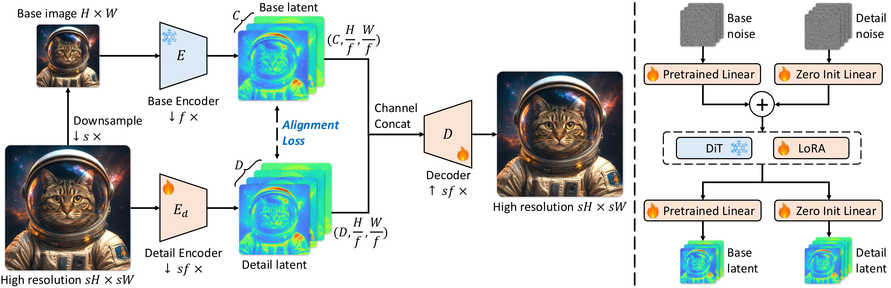
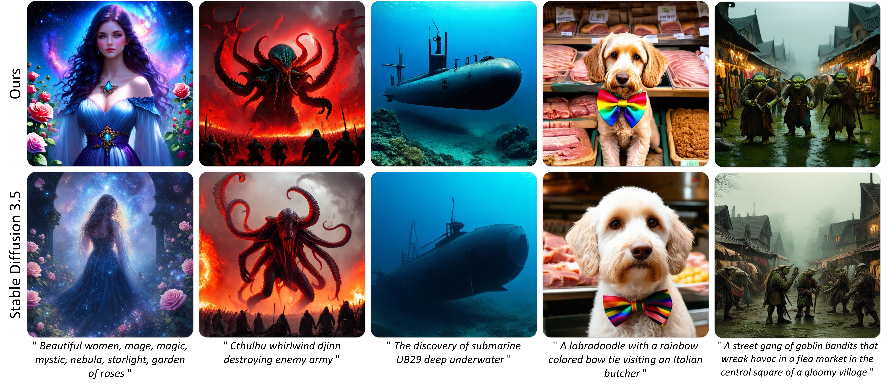
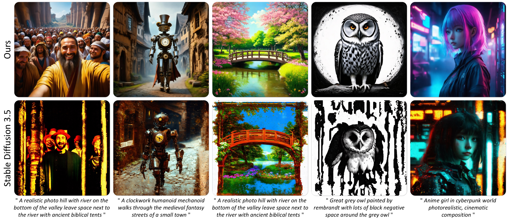

# DA-VAE: Plug-in Latent Compression for Diffusion via Detail Alignment

<div align="center">

<a href="https://caixin98.github.io" target="_blank">Xin Cai</a><sup>1,3</sup>&emsp;
<a href="https://zhiyuanyou.github.io" target="_blank">Zhiyuan You</a><sup>1</sup>&emsp;
<a href="https://ztzhang.info" target="_blank">Zhoutong Zhang</a><sup>2†</sup>&emsp;
<a href="https://tianfan.info" target="_blank">Tianfan Xue</a><sup>1,3,4</sup>

<sup>1</sup>Multimedia Laboratory, CUHK&emsp;<sup>2</sup>Adobe NextCam&emsp;<sup>3</sup>Shanghai AI Laboratory&emsp;<sup>4</sup>CPII under InnoHK

<sup>†</sup>Project lead

[](https://arxiv.org/abs/2603.22125)
[](https://caixin98.github.io/davae)
[](https://github.com/caixin98/DA-VAE)


</div>

<div align="center">
  
  <br>
  <em>All images are generated by SD3.5-Medium + DA-VAE using only 32×32 latent tokens at 1024×1024 resolution.</em>
</div>

## Highlights

- **4× fewer tokens at 1K resolution.** Generate 1024×1024 images with a 32×32 token grid instead of 64×64, cutting self-attention cost by ~16×.
- **Plug-in, no retraining from scratch.** Upgrade any pretrained VAE + DiT pair. Fine-tune with LoRA in just 5 H100-days.
- **Structured base+detail latent.** Detail channels are explicitly aligned to the pretrained latent structure, making them easy for diffusion to model.
- **Scales to 2K.** Enables coherent 2048×2048 generation with SD3.5-Medium at ~6× speedup, where the original model fails.

## Introduction

Current diffusion models need an impractical number of tokens for high-resolution generation, while existing high-compression tokenizers require retraining the diffusion backbone from scratch. **DA-VAE** offers a plug-in alternative: it upgrades a pretrained VAE into a structured **base+detail** latent with higher compression, then fine-tunes the diffusion model on top — preserving what was already learned.

<div align="center">
  
  <br>
  <em>Overview of DA-VAE. Left: structured base+detail latent with alignment loss. Right: zero-init warm-start for DiT adaptation.</em>
</div>

### Key ideas

1. **Structured Latent Space** (Section 3.1): The first C channels are the *unchanged* pretrained VAE latent at base resolution; an additional D channels encode high-resolution details from a separate detail encoder.

2. **Detail Alignment Loss** (Eq. 3–4): A parameter-free channel-wise grouped reduction aligns detail channels z_d with the base latent z, preventing them from collapsing into noisy residuals.

3. **Zero-Init Warm Start** (Section 3.2): New patch embedder P' and output layer O' are zero-initialized so the model starts as an exact copy of the pretrained DiT.

4. **Gradual Loss Scheduling** (Eq. 12–13): Cosine-annealed weighting gradually introduces detail channel losses during fine-tuning, stabilizing optimization.

## Results

### Text-to-Image: SD3.5-Medium at 1024×1024

| Method | Autoencoder | Tokens | Params (B) | Throughput (img/s) | FID ↓ | CLIP Score ↑ | GenEval ↑ |
|--------|-------------|--------|------------|-------------------|-------|-------------|-----------|
| PixArt-Σ | — | 64×64 | 0.6 | 0.40 | 6.15 | 28.26 | 0.54 |
| SANA-1.5 | DC-AE (f32c32p1) | 32×32 | 4.8 | 0.26 | 5.99 | 29.23 | 0.80 |
| FLUX-dev | FLUX-VAE (f8c16p2) | 64×64 | 12 | 0.04 | 10.15 | 27.47 | 0.67 |
| SD3.5-medium | SD3-VAE (f8c16p2) | 64×64 | 2.5 | 0.25 | 10.31 | 29.74 | 0.63 |
| SD3.5-medium† | SD3-VAE (f8c16p2) | 32×32 | 2.5 | 1.03 | 12.04 | 30.17 | 0.63 |
| **Ours (SD3.5-M + DA-VAE)** | **DA-VAE (f16c32p2)** | **32×32** | **2.5** | **1.03** | **10.91** | **31.91** | **0.64** |

<sub>FID and CLIP Score on MJHQ-30K (1024×1024). Throughput on one A100 GPU (BF16, batch=10). † denotes 512→1024 upsampling baseline.</sub>

### ImageNet 512×512: Training Efficiency

| Method | Autoencoder | rFID | Tokens | Epochs | FID-50k (w/o CFG) | FID-50k (w/ CFG) | IS |
|--------|-------------|------|--------|--------|-------------------|------------------|----|
| DiT-XL | SD-VAE (f8c4p2) | 0.48 | 32×32 | 2400 | 12.04 | 3.04 | 255.3 |
| REPA | SD-VAE (f8c4p2) | 0.48 | 32×32 | 200 | — | 2.08 | 274.6 |
| DC-Gen-DiT-XL | DC-AE (f32c32p1) | 0.66 | 16×16 | 80 | 8.21 | 2.22 | 122.5 |
| LightningDiT-XL | VA-VAE (f16c32p2) | 0.50 | 16×16 | 80 | 11.31 | 3.12 | 254.5 |
| **Ours (DA-VAE)** | **DA-VAE (f32c128p1)** | **0.47** | **16×16** | **25** | **6.04** | **2.07** | **277.6** |
| **Ours (DA-VAE)** | **DA-VAE (f32c128p1)** | **0.47** | **16×16** | **80** | **4.84** | **1.68** | **314.3** |

### Autoencoder: Reconstruction vs Generation Trade-off

| Autoencoder | rFID ↓ | PSNR ↑ | LPIPS ↓ | SSIM ↑ | FID-10k ↓ |
|-------------|--------|--------|---------|--------|-----------|
| SD-VAE (f8c4p4) | 0.48 | 29.22 | 0.13 | 0.79 | 58.17 |
| DC-AE (f32c32p1) | 0.66 | 27.78 | 0.16 | 0.74 | 35.97 |
| VA-VAE (f16c32p2) | 0.50 | 28.43 | 0.13 | 0.78 | 44.65 |
| **DA-VAE (f32c128p1)** | **0.47** | **28.53** | **0.12** | **0.78** | **31.51** |

<sub>All generation models were trained from scratch with the same token budget. DA-VAE achieves the best reconstruction-generation trade-off.</sub>

## Installation

```bash
git clone https://github.com/caixin98/DA-VAE.git
cd DA-VAE
```

### For ImageNet experiments

```bash
cd lightningdit
pip install -r requirements.txt
```

### For SD3.5 experiments

```bash
cd sd3
pip install -r requirements.txt
```

## Repository Structure

```
DA-VAE/
├── lightningdit/                # ImageNet experiments (Section 4.1)
│   ├── train.py                 # DiT fine-tuning with DA-VAE latent
│   ├── inference.py             # Class-conditional sampling
│   ├── evaluate_tokenizer.py    # rFID / PSNR / LPIPS / SSIM
│   ├── models/                  # LightningDiT transformer (SwiGLU, RoPE, RMSNorm)
│   ├── tokenizer/               # DA-VAE and VA-VAE inference wrappers
│   ├── davae/                   # DA-VAE core (LDM encoder/decoder + alignment)
│   ├── transport/               # Rectified flow ODE/SDE sampling
│   └── configs/                 # Training configurations
│
└── sd3/                         # SD3.5 text-to-image experiments (Section 4.2)
    ├── modeling/                 # SD3 DA-VAE model (encoder/decoder, losses, wrapper)
    ├── davae/                    # DA-VAE tokenizer training scripts & configs
    ├── omini/
    │   ├── train_sd3_davae/      # DA-VAE tokenizer training with SD3
    │   ├── train_sd3_hr/         # SD3.5M LoRA fine-tuning (zero-init + loss schedule)
    │   └── pipeline/             # SD3 inference pipeline (zero-init patch embedder)
    ├── train/                    # Launch scripts and configs for LoRA fine-tuning
    ├── eval/                     # FID / GenEval / CLIP Score evaluation
    └── data/                     # Data loaders (local image, WebDataset)
```

## Usage

### ImageNet Experiments

**Train DA-VAE + LightningDiT** (paper final config, FID=1.68):

```bash
cd lightningdit
bash run_train.sh configs/lightningdit_xl_davae_f32d128_detail_align_mean_loss_schedule.yaml
```

**Inference:**

```bash
bash run_inference.sh configs/lightningdit_xl_davae_f32d128_detail_align_mean_loss_schedule.yaml
```

**Tokenizer evaluation** (rFID / LPIPS / SSIM):

```bash
python evaluate_tokenizer.py \
    --config_path tokenizer/configs/da_f16d32_detail_align_mean.yaml \
    --model_type davae \
    --data_path /path/to/imagenet/val \
    --output_path /tmp/davae_results
```

### SD3.5 Text-to-Image Experiments

**Stage 1: Train DA-VAE tokenizer** (detail encoder + joint decoder):

```bash
cd sd3
accelerate launch davae/scripts/train_davae.py \
  --config_path davae/configs/training/SD3DAVAE/base.yaml
```

**Stage 2: Fine-tune SD3.5M with LoRA** on the DA-VAE latent space:

```bash
OMINI_CONFIG=train/config/sd3_da/token_text_image_da_vae_with_lora_diff_sd35_local_residual_new_2k.yaml \
  bash train/script/sd3_da/token_text_image_da_vae_with_lora_sd35_local_residual_2k_ddp.sh
```

See individual subdirectory READMEs for detailed configuration guides.

## Qualitative Results

<div align="center">
  
  <br>
  <em>DA-VAE vs SD3.5-M baseline at 1024×1024. DA-VAE produces richer details and better prompt fidelity.</em>
</div>

<br>

<div align="center">
  
  <br>
  <em>DA-VAE enables coherent 2048×2048 generation where the original SD3.5-M collapses.</em>
</div>

<br>

<div align="center">
  
  <br>
  <em>ImageNet 512×512 samples from DA-VAE + LightningDiT-XL.</em>
</div>

## Acknowledgement

This repository builds upon [LightningDiT](https://github.com/hustvl/LightningDiT), [DC-AE](https://github.com/dc-ai-projects/DC-Gen/blob/main/projects/DC-AE.md), and [Stable Diffusion 3](https://stability.ai/). We thank the authors for their excellent work.

## Citation

If you find DA-VAE useful in your research, please consider giving us a star and citing it:

```bibtex
@inproceedings{cai2026davae,
  title={{DA-VAE: Plug-in Latent Compression for Diffusion via Detail Alignment}},
  author={Cai, Xin and You, Zhiyuan and Zhang, Zhoutong and Xue, Tianfan},
  booktitle={CVPR},
  year={2026}
}
```

## License

See [lightningdit/LICENSE](lightningdit/LICENSE) for details.
